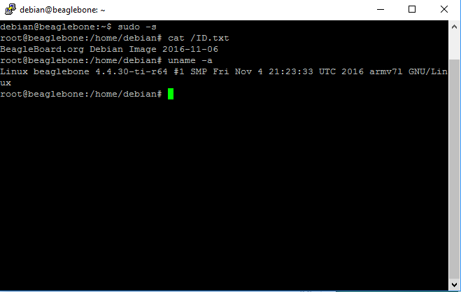

# Blink LED with Programmable Realtime Unit 
This is to introduce the embedded visible light communication system based on BeagleBone Black (Rev. C). 

## What do you need to get started
* 2 x [BBB Rev.C ](https://beagleboard.org/black) 
* 2 x [OpenVLC Cape](http://nsl.cs.uh.edu/~syin/openvlc/cape1.png)
* 2 x [mini USB cable](http://nsl.cs.uh.edu/~syin/openvlc/miniUSB.jpg)
* 2 x [LED (Type 1)](http://www.vishay.com/docs/83178/tlcr5800.pdf)
* 2 x [LED (Type 2)]
* 2 x [Power Supply](http://elinux.org/images/7/72/DC_Supply.jpg).

## Hardware Assembly
1. Attach the cape on top of BBB.
2. Attach LED on the pinout of the cape. See the [instructions](http://nsl.cs.uh.edu/~syin/openvlc/led_installation.pdf)
3. Power up the board.
4. Connect the mini USB cable to your PC/Desktop USB port.

## Software Preparation
1. Installing the image:
   - **Purple image**: 
   - Download the [image](https://debian.beagleboard.org/images/bone-debian-8.6-lxqt-4gb-armhf-2016-11-06-4gb.img.xz)
   * After downloading the image, you need 7-zip to extract the img file. You can first download [7-zip](http://www.7-zip.org/download.html). Then right click on the image file with the 7zip option to extract here.
   * Install the image (.img file) on a micro SD card. You can following the [Raspberry Pi example](https://www.raspberrypi.org/documentation/installation/installing-images/). If you are using Windows, you can download [Win32Imager](https://sourceforge.net/projects/win32diskimager/) and install the application, and write the .img file to SD card. You may need a [USB-to-microSD adaptor](https://www.amazon.com/Sabrent-SuperSpeed-Windows-Certain-Android/dp/B00OJ5WBUE/ref=pd_lpo_147_bs_t_2?_encoding=UTF8&psc=1&refRID=QDRY01B5EGVBRQ0SWN4G) if the computer you are using does not have the SD card slot. It will approximately take 10-20 minutes to write the image to your microSD card depending on the speed of the CPU that is running on your computer.
   * Insert the SD card to BBB and plug in BBB board on your computer via the provided USB cable.
   * If the OS running on your computer in Windows 10, you need to get a BBB driver for signed signature to be installed on your windows. You can download [this one](http://www.1-2-3-4-5-6.net/beaglebone/black/BONE_D64_signed.zip).
   * Download [Putty](http://www.chiark.greenend.org.uk/~sgtatham/putty/download.html) and connect from Windows to the BeagleBone board using Putty. 
   * Connect to the BBB board via ssh.
     `ssh debian@192.168.7.2`
   * After you logged in to the board, you can following [this link](http://elinux.org/EBC_Exercise_30_PRU_via_remoteproc_and_RPMsg) to load PRU kernel modules. To sum up, it is really important for you to follow the sequence.
   * In order to make things easier, we type all commands using root. To change the user to root, simply type the following command in a
   terminal 
   ```
   sudo -s
   ```
2. Enabling PRU module via Remoteproc framework:
   * **Check version**: we need to make sure the board version is larger than 4.4.12-ti-r32 or the following instructions will be invalid.
   
   ```
   cat ./ID.txt
   uname -a
   ```
   * **Disable the HDMI**: The BBB provide multiplexing for the GPIOs, both PRU and HDMI will share the same GPIOs, so we have to disable the HDMI before we enable the PRU. How do we know whether the HDMI is disabled:
   
   ```
   config-pin -q P8_45
   ```
   If the message was shown up in the terminal, we need to disable the HDMI. Open the `/boot/uEnv.txt`
   
   ```
   nano /boot/uEnv.txt
   ```
   After uncommenting # in line number 10, we save the file and reboot.
   
   ```
   reboot
   ```
   
   

 	
2. Check on your PC/Desktop to see whether you have USB connections after you assembled all hardware.
   * **For Mac Users**: Type `option` + `space` key in your keyboard to open network preference, you will observe all operating connections. Click on the BeagleBone Black connection to see the IP address. Normally, this would be `192.168.7.1`. Once you confirmed with IP, you can connect to the board via SSH. 
   * **For Linux Users**: Open Terminal, and type `ifconfig` to see available network connections. You will observe the 
USB connection with IP address of `192.168.7.1`. Connect to the board via SSH.
   * **For Windows Users**:  First, you need to install the BeagleBone [USB drivers](http://beagleboard.org/static/Drivers/Windows/BONE_D64.exe) for windows. Before you do that, you have to disable driver signature verification on 64-Bit Windows 8 or 10 so that you can install the USB driver which is unsigned. To disable driver signature verification, please follow option 2 in this [link](http://www.howtogeek.com/167723/how-to-disable-driver-signature-verification-on-64-bit-windows-8.1-so-that-you-can-install-unsigned-drivers/). Once you install the USB driver successfully, you can open `Command Line Tools` and type `ipconfig`. You will notice a IP which is `192.168.7.1` from
the result. This shows the USB driver is successfully installed. 

## Connecting to the BeagleBone Board (SSH)
   * **For Mac and Linux Users**: By default, the OS should already have SSH installed. So you can open terminal and type the following command  `ssh machinekit@192.168.7.2`. The default password is `machinekit`.
   * **For Windows Users**: You need to configure Putty using the IP address `192.168.7.2`. You can following this [tutorial](https://mediatemple.net/community/products/dv/204404604/using-ssh-in-putty-) to configure the SSH connection in Putty.


 

