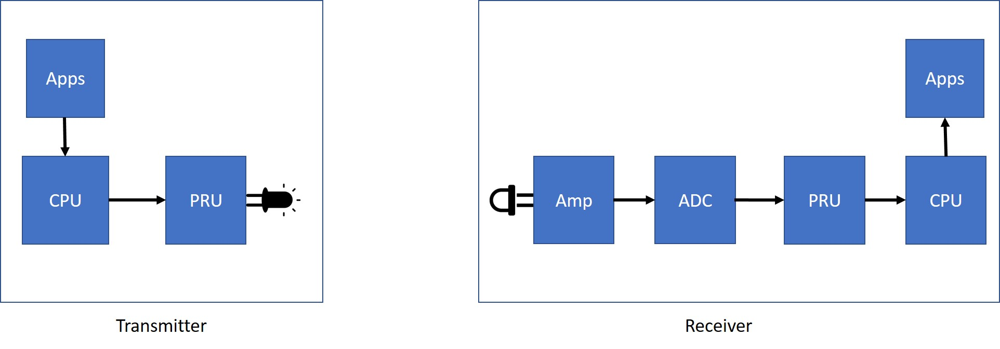

# Project Description.
In this project, students are going to build a simple LED-to-Photodiode communication system that can transmit "hello world"
message from the tranmitter to the receiver. The overall data flow for this project is shown in the following figure.

* Apps: The apps is a userspace program that needs to send some information to PRU so that PRU can control the LED to send the uplayer information. For example, the userspace program in this project needs to read a file and send the file content to PRU. The file content is 
"hello world".
* CPU: The CPU is 1GHz ARMv7. It runs a debian Linux and it provides IPC mechanism to facilitate the communication between userspace program and kernel. So that it forwards the message from userspace to PRU with the help of kernel drivers. In this project, we will apply the latest framework suggested by TI to implement the messaging forwarding.
* PRU: The PRU is another processor with a speed of 200MHz. TI has released an open-source C-compiler for this processor such that developers can write C code under Linux to be running on PRU. In this project, we'll provide example C code to modulate the forwarded message by controlled LED built on the transmitter.
* Amp: This is a transimpedent amplifier that is used to amplify the voltage signal from the photodiode. It has lots of electronics. But the board you'll working on has the built-in amplifier such that you don't need to worry about all the electronics detail.
* ADC: This will convert the amplified signal from analog to digital so that PRU can acturally recognize the bits. You may need to understand how ADC and PRU communication in order to understand the conversion process. But don't worry, We'll teach you how the ADC work and how the PRU receive the data from the ADC step-by-step. You may need to worry about how to decode the message from noises. 
* PRU: Well, it will be basically a lot of data coming out from the ADC, and the PRU needs to recognize the correct byte. For this part, you need to design the packet encoding mechanism. The good thing is there are tons of tutorials online teaching you how to encode the packet. Acturally, it should be frame since we are discussing the data communiation in PHY layer. But the principles are the same as all you need to care is how much payload you should allocate for a packet/frame. What should be the packet/frame header? Do we need some synchornization byte or not. Do we also need the meta bytes at the end of the packet/frame? Is it also a good idea to add the packet/frame length?
* Apps: In the apps of the receiver, your userspace program will simply receive the bytes from PRU and display on the termincal with ASCII format.
# What you will learn from this project.
* Students will learn practical skills working under Linux Environment.
* Students will learn basic Linux commands.
* Students will learn how practical wireless communication system works.
* Students will learn basic modulation technique.
* Students will learn how to improve optic communication performance.
* Students will learn how to communicate between kernel and userspace.
* Students will learn how to encode and decode packets in PHY layer.
* Students will learn how to compile and debug Assembly/C program under Linux.
# What do you need to do in the project.
1. Modify a C program that can be successfully compiled and run in PRU such that the PRU will run this program to send the message 
with the onboard LED.
2. Modify a C program that can be successfully compiled and run in PRU such that the PRU will run this program to receive the message
with onboard Photodiode.
3. Write a C program that is similar to previous examples to adapt the packet decoding under various number of LEDs (optional)?

